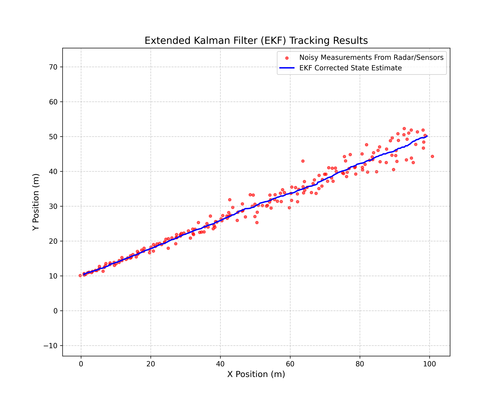

# Extended Kalman Filter (EKF) Tracker

A C++/Python program that implements an Extended Kalman Filter in order to filter out sensor noise and track the trajectories of non-linear targets. It utilizes simulated polar radar sensor measurements to function.

# Project Sections

"main.hpp": Header file containing declarations for the EKF class, its member functions, and variables.

"main.cpp": Contains the execution loop and handles change in time calculations.

"ExtendedKalmanFilter.cpp": Contains function definitions governing matrix algebra, the prediction step, and corrections using a Jacobian matrix.

"dataset_generator.py": Outputs simulated object/target path and creates noisy radar measurement values.

"ekf_plotter.py": Reads the EKF output and plots a corrected trajectory path through the inclusion of Pandas and MatPlotLib.

# Sample Result

The EKF is able to successfully filter out radar noise and output a very clean trajectory.
